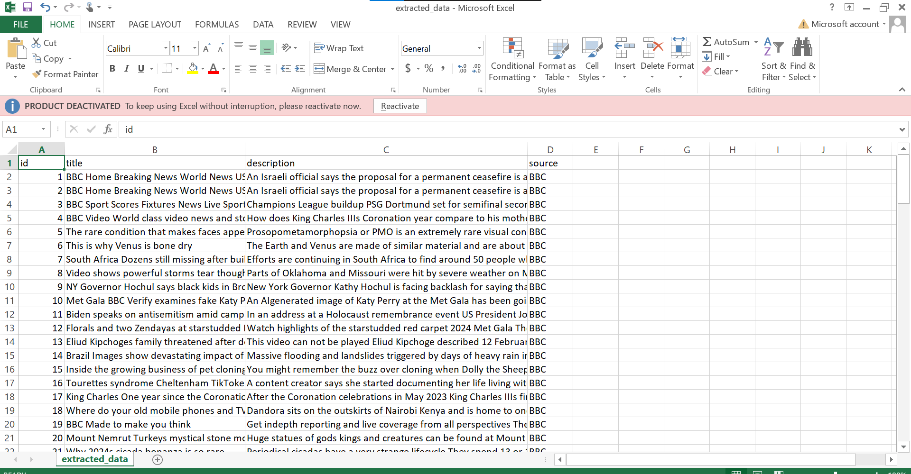
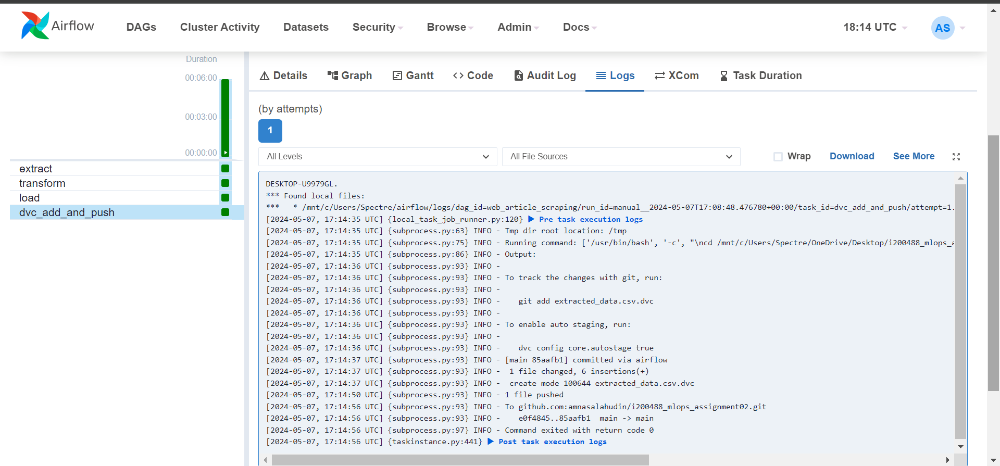
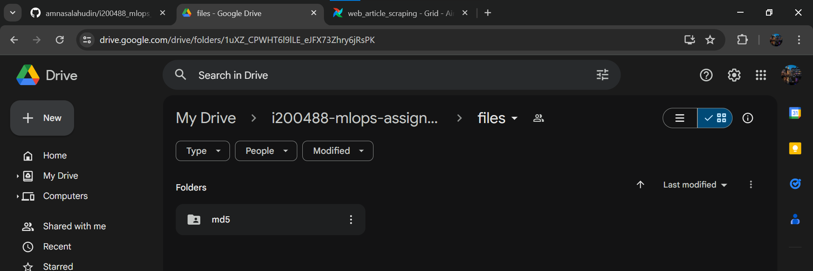

# Assignment Report: MLOps Implementation with Apache Airflow

## Introduction

This report outlines the implementation of an MLOps workflow using Apache Airflow to automate the processes of data extraction, transformation, and version-controlled storage. The primary goal was to streamline the data handling processes from dawn.com and BBC.com, ensuring that the extracted data is cleaned, transformed, and stored efficiently with version tracking.

## Workflow Description

### Data Extraction

The data extraction process involves scraping the homepages of BBC.com and Dawn.com to retrieve the latest articles. Using Python's `requests` and `BeautifulSoup` libraries, the DAG extracts links, titles, and descriptions of articles from these sources.

### Data Transformation

Extracted data undergoes transformation to clean and format the text appropriately. This includes removing excessive whitespace, special characters, and ensuring the text is in a suitable format for analysis. The transformation process prepares the data for storage by structuring it into a pandas DataFrame.

### Data Storage and Version Control

The transformed data is saved into a CSV file stored on Google Drive. Data Version Control (DVC) is employed to track changes in the dataset. The setup includes configuring DVC with a remote storage, adding data files to DVC tracking, and pushing updates to a Git repository.

### Apache Airflow DAG

The entire process is automated using an Apache Airflow DAG which schedules and executes these tasks daily. The DAG handles task dependencies and ensures robust error management throughout the workflow.

## Challenges Encountered

Challenges encountered:

1. Working with Airflow tool on Windows, it required installing Airflow with WSL Ubuntu.

2. Encountering errors when using the BashOperator which included not necessary permssions for accessing the Git credentials which was later solved after trial and error.

## Step-by-Step Guide with Screenshots

### Step 1: Prepare the Airflow DAG
First, write the Python script for the Airflow DAG. Once written, copy the script to the `airflow/dags` folder to ensure it is recognized by Airflow.

### Step 2: Initialize Git and DVC
Initialize the Git repository and DVC within the project directory. Use `dvc init` to set up DVC and add a remote storage to manage the datasets versions.

### Step 3: Start Airflow Services
Launch the Airflow webserver and scheduler to begin orchestrating the DAGs. 

### Step 4: Activate the DAG
Navigate to the Airflow web interface, locate the "web-article-scrapping" DAG, and either enable it or trigger it manually.

### Step 5: Monitor Task Execution
Observe the execution of tasks within the DAG. The progress and status of each task can be viewed through the Airflow web interface.

### Step 6: Data Extraction
The title and descriptions of the articles were successfully extracted. The data salso included added columns for 'id' and 'source'.

### Step 7: Execute DVC Commands
After running `dvc add` and `dvc push`, the data files were successfully version-controlled and stored using both DVC and Git. The DVC manifest file, including the hash of the data file, was created and pushed to the remote storage. Simultaneously, the DVC files that describe the data were committed to the Git repository. This ensures synchronization and maintenance of the data and its version control metadata across both platforms.

